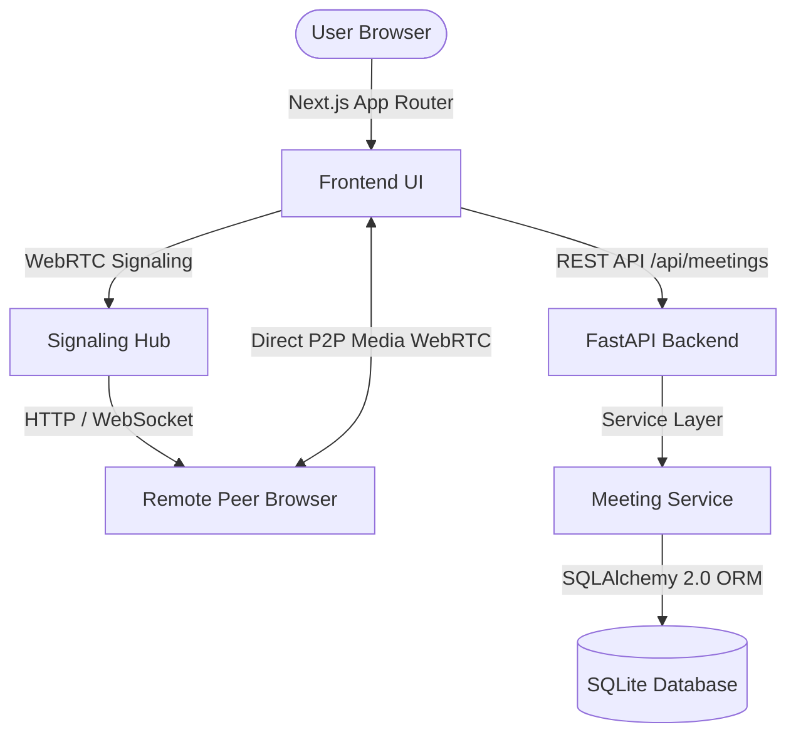
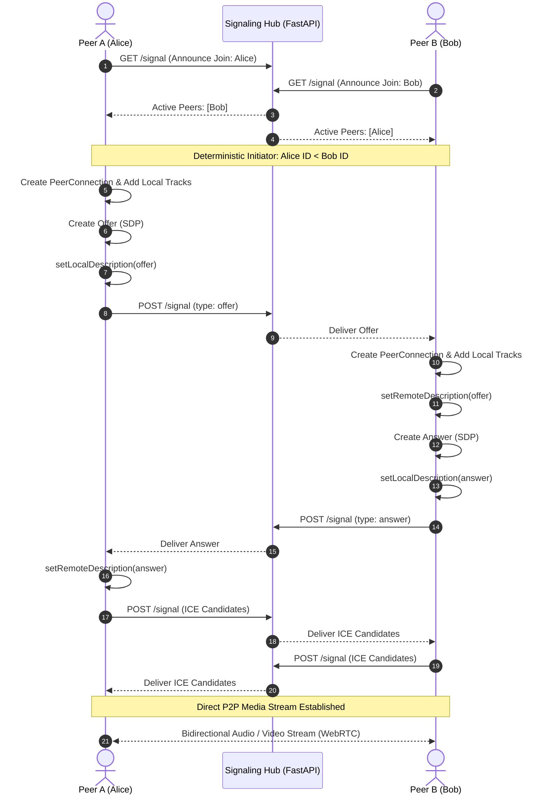

# Video Conferencing Platform

This project is a full stack video conferencing web application inspired by Zoom Workplace, built as part of the Scaler AI Labs Full Stack evaluation.

The goal was to build a reliable web-based meeting platform from scratch that solves the friction of setting up and joining real-time video calls. Users can launch an instant meeting in one click, schedule discussions for a later date, and join ongoing rooms using a short meeting code or shareable invite link without installing native desktop software. Under the hood, the application pairs a Next.js frontend with a FastAPI backend, an SQLite relational database, and browser-native WebRTC peer-to-peer streaming with a dual-protocol signaling layer.

## What I Built

I built a web application that replicates the familiar desktop and web experience of Zoom Workplace. When a user opens the application, they land on a dark-themed collaboration dashboard featuring a live digital clock, quick action tiles, and real-time feeds of upcoming scheduled meetings and past call history.

From the user's perspective, the workflow is straightforward:

A user can click New Meeting to spin up an instant room. The application immediately generates a collision-resistant room code, copies a direct URL to the clipboard, and routes the host into the call room.

A participant can join any room by clicking Join and typing the meeting code or pasting a meeting link. They can set their display name before entering so they are recognized by other attendees.

A user can click Schedule to plan a future meeting. They specify the meeting topic, date, start time, and estimated duration. The meeting is saved to the backend database and automatically surfaces in the dashboard's upcoming meetings list with quick-join and link-copy actions.

Once inside a meeting room, participants enter an interactive audio and video workspace with live camera tiles, mute and unmute controls, camera toggles, a screen share preview, an active participants drawer, and an in-room real-time text chat.

## Main Features

### Instant Meetings

Instant meetings are designed for zero-delay collaboration. When the user clicks the New Meeting button on the dashboard, the frontend requests an instant session from the backend via `POST /api/meetings/instant`. 

The backend generates a cryptographically random, collision-resistant code following the format `vom-xxx-xxxx-xxx` using 36 alphanumeric characters, providing over 3.6 quadrillion potential combinations. It creates a record in the database with its status set to waiting and constructs the full shareable URL. 

The frontend presents a confirmation modal displaying the room code and invite link, copies the link to the user's clipboard, and lets the host transition straight into the meeting room. If the backend is cold-starting or temporarily unreachable, the frontend has a resilient client-side fallback that generates a safe unique room code on the fly so the user is never blocked from starting their call.

### Joining a Meeting

Participants can enter a call using either the dedicated Join modal on the dashboard, the standalone `/join` page, or by clicking a direct invite link shared by the host. 

When a user pastes a full meeting URL or types a code, the frontend normalizes the input by stripping extraneous protocols, query parameters, and route fragments, converting the code to lowercase. The user specifies their preferred display name, which defaults to a friendly placeholder. 

The frontend queries `GET /api/meetings/{code}` to validate the room. If the record exists, the user is admitted. If someone joins a direct room link that was generated on the client side or prior to a backend database restart, the backend's route handler automatically provisions the meeting record on demand. This eliminates blocking 404 screens and ensures that every valid link connects cleanly.

### Scheduled Meetings

The scheduling workflow allows users to plan calendar events in advance. Clicking the Schedule button opens a form where the user enters the meeting title, an optional agenda description, the scheduled date, start time, and estimated duration ranging from 15 to 90 minutes.

Submitting the form sends a payload to `POST /api/meetings/schedule`. The backend validates the inputs through Pydantic schemas, ensures the meeting code is unique, records the ISO 8601 timestamp in SQLite, and returns the persisted meeting object. 

The new meeting immediately appears in the Upcoming Meetings feed on the dashboard, sorted chronologically with the soonest meetings at the top. Each card displays the meeting title, scheduled time, duration badge, a one-click copy button for the invite link, and a Start button that routes directly to the room.

### Meeting Room

The meeting room at `/meeting/[meetingId]` is the core real-time interface. It features a responsive layout with a top navigation bar showing meeting details, a live elapsed call timer, an end-to-end encryption status indicator, and a bottom control dock modeled after Zoom's in-call toolbar.

The control dock includes:
A microphone toggle to mute and unmute the local audio track.
A camera toggle to enable or disable local video transmission.
A screen sharing toggle that requests display capture from the browser and streams the screen to peers.
A participants button with a live count badge that opens a sliding side drawer showing everyone currently in the room.
A chat button that opens an in-call messaging panel for sharing links and text notes.
A red End Meeting button that gracefully leaves the room, closes media hardware, notifies peers, and redirects back to the dashboard.

### Video and Audio

Media management is handled directly through the browser's `navigator.mediaDevices` API. When entering a room, the application requests access to the user's camera and microphone with ideal video dimensions of 1280 by 720 pixels. If microphone access is denied or unavailable on the host machine, the application catches the error and falls back to a video-only stream rather than failing completely.

The video conferencing engine uses native WebRTC `RTCPeerConnection` for direct browser-to-browser media streaming. Once two participants are in the room:
1. Each client captures its local `MediaStream` containing audio and video tracks and attaches them to its `RTCPeerConnection`.
2. The clients exchange session descriptions (SDP offers and answers) through the signaling layer.
3. The browser gathers ICE candidates representing local IP addresses, network ports, and STUN/TURN relays, and sends them to the remote peer.
4. When candidates and session descriptions are applied, peer-to-peer media paths are established, remote tracks fire the `ontrack` event, and the remote video stream is rendered inside the remote video tile.

### Participants

Participants are tracked both relationally in the database and ephemerally in signaling memory. 

In SQLite, the `participants` table maintains permanent session join records, linking the participant's display name and timestamp to the corresponding meeting ID. 

In active call sessions, participants are assigned a session-stable participant ID stored in `sessionStorage`. This prevents identity resets if the user refreshes their browser tab. The signaling server tracks heartbeats, handles join announcements, relays peer messages, and removes participants from active lists if they close their window or leave the room.

### Dashboard

The dashboard serves as the central control hub. It includes:
Four primary Zoom action buttons: New Meeting (orange), Join (blue), Schedule (blue), and Share Screen (blue).
A live digital clock showing the current system time and day.
An Upcoming Meetings panel displaying all pending scheduled calls with duration and direct launch triggers.
A Recent Meetings panel showing finished or past meetings with their status and copyable links.
A top header featuring the Zoom Workplace branding, a global search input, quick settings access, and a mock user profile menu.

## How the Application Works

Voom follows a decoupled client-server architecture where the frontend handles user interaction and WebRTC media streams, while the FastAPI backend provides RESTful resource persistence and WebRTC signaling coordination.



A typical interaction moves through the system in the following sequence:

1. User Action: The user triggers an action in the frontend, such as scheduling a meeting.
2. Frontend Processing: The client validates the form inputs, formats dates into standard ISO strings, and calls the typed method in `src/lib/api.ts`.
3. API Request: The request is sent to the FastAPI backend over HTTP. During local development, Next.js rewrites reverse-proxy `/api` requests to port 8000, preventing CORS friction.
4. FastAPI Route: The router at `app/routes/meetings.py` receives the request. Pydantic validates the request body against defined schemas.
5. Service Layer: The route delegates execution to `app/services/meeting_service.py`. The service handles business logic, generates unique codes, and builds database models.
6. SQLAlchemy ORM: SQLAlchemy translates the model operations into SQL statements and executes them against the database session.
7. SQLite Persistence: The data is written to the local SQLite database file `voom.db`.
8. Response: FastAPI serializes the database model into a JSON response conforming to the `MeetingResponse` schema and returns an HTTP 201 status code.
9. Frontend Update: The Next.js frontend receives the response, updates local React state, displays a toast notification, and refetches dashboard lists.

## Project Structure

The repository is organized as a clean polyglot monorepo with distinct frontend and backend directories.

```
Voom/
|-- backend/
|   |-- app/
|   |   |-- models/          # SQLAlchemy ORM database models
|   |   |   |-- meeting.py   # Meeting entity with status and type enums
|   |   |   |-- participant.py # Meeting participant records
|   |   |   `-- user.py      # Host user model
|   |   |-- routes/          # FastAPI API route handlers
|   |   |   |-- health.py    # System health check endpoint
|   |   |   |-- meetings.py  # Meeting CRUD and join endpoints
|   |   |   `-- signaling.py # WebRTC HTTP and WebSocket signaling
|   |   |-- schemas/         # Pydantic request and response schemas
|   |   |   |-- common.py    # Base schemas
|   |   |   `-- meeting.py   # Validation contracts for meeting APIs
|   |   |-- services/        # Domain business logic
|   |   |   `-- meeting_service.py # Code generation and database operations
|   |   |-- config.py        # Environment settings and configuration
|   |   |-- database.py      # SQLAlchemy engine, session maker, and seed loader
|   |   `-- main.py          # FastAPI application entry point and CORS setup
|   |-- tests/
|   |   `-- test_meetings.py # Automated integration tests for meeting APIs
|   |-- requirements.txt     # Pinned Python dependencies
|   `-- voom.db              # SQLite database file
|-- frontend/
|   |-- src/
|   |   |-- app/             # Next.js App Router pages
|   |   |   |-- dashboard/   # Standalone dashboard view
|   |   |   |-- join/        # Dedicated meeting join page
|   |   |   |-- meeting/     # Dynamic meeting room route [meetingId]
|   |   |   |-- schedule/    # Standalone schedule page
|   |   |   |-- globals.css  # Global styles and Tailwind v4 setup
|   |   |   |-- layout.tsx   # Root layout shell
|   |   |   `-- page.tsx     # Home page routing
|   |   |-- components/
|   |   |   |-- ui/          # Reusable design primitives (Button, Card, Input, Modal, Toast)
|   |   |   |-- zoom/        # Zoom Workplace specific components and modals
|   |   |   `-- Navbar.tsx   # Top application navigation bar
|   |   `-- lib/
|   |       |-- api.ts       # Typed backend API client
|   |       `-- webrtc.ts    # WebRTC configuration, STUN, and peer helper
|   |-- package.json         # Frontend dependencies and scripts
|   |-- next.config.ts       # Next.js configuration and API proxy rewrites
|   `-- vercel.json          # Vercel deployment specification
|-- docs/
|   |-- ARCHITECTURE.md      # Architecture diagrams and system flow documentation
|   `-- DECISIONS.md         # Detailed engineering decision log
|-- render.yaml              # Render deployment configuration for the backend
`-- .env.example             # Template for environment variables
```

### Directory Responsibilities

The `frontend/src/app` directory contains the application routes using Next.js App Router conventions. Dynamic parameters such as `/meeting/[meetingId]` allow any valid room code to map directly to an active meeting room instance.

The `frontend/src/components/ui` directory contains custom design system primitives including buttons, inputs, modal containers, cards, and toast notifications. These components provide uniform spacing, colors, and accessibility attributes across all views.

The `frontend/src/components/zoom` directory contains higher-level feature components replicating Zoom Workplace, including the action buttons, digital clock, schedule dialog, instant meeting dialog, and setting panels.

The `frontend/src/lib` directory isolates client infrastructure. `api.ts` houses the typed fetch client and meeting helper functions, while `webrtc.ts` defines the ICE server configuration, STUN relays, and peer connection factories.

The `backend/app/routes` directory provides thin HTTP controllers that deserialize incoming requests, run Pydantic schema validation, invoke service functions, and return typed responses.

The `backend/app/services` directory contains pure domain business logic. It handles cryptographic meeting code generation, uniqueness checks, default user assignment, and database queries without direct coupling to HTTP transport objects.

The `backend/app/models` and `backend/app/schemas` directories separate the database persistence layer from the public API contract. SQLAlchemy models define tables and foreign keys, while Pydantic schemas enforce input validation rules and serialize outgoing JSON.

The `docs` directory maintains project documentation including the architecture specifications and engineering trade-off logs.

## Development Journey

The project was developed in iterative phases, with each phase building upon verified foundations. The git history reflects this progression.

### Phase 1: Project Foundation

The development began with establishing the repository architecture. I chose a monorepo structure with distinct `frontend/` and `backend/` directories. This kept dependencies strictly isolated: Node.js packages stayed inside the frontend folder, while Python dependencies were isolated inside the backend virtual environment.

I selected Next.js with the App Router for the frontend to take advantage of clean file-based dynamic routing and modern React patterns. For the backend, FastAPI was chosen for its high execution speed, native async handling, and automatic Pydantic validation. SQLite was selected as the database because it requires zero server setup while providing full SQL compliance and easy local development.

### Phase 2: Backend Foundation

In the second phase, I set up the core FastAPI application in `backend/app/main.py`. I implemented a modular router architecture, separating concerns into individual route modules.

I added a health check route (`GET /api/health`) to enable smoke testing and uptime verification. I configured CORS middleware to allow requests from the local Next.js development server on port 3000, as well as deployment origins on Vercel and tunnel domains. I also established the application lifespan handler to automatically initialize database tables on startup.

### Phase 3: Database Design

Next, I implemented the relational database layer using SQLAlchemy 2.0. I designed three core models: `User`, `Meeting`, and `Participant`.

I made several intentional architectural decisions during this phase. I separated `participants` from `users` so that guests could join calls with just a display name without being forced to create an account. I separated the public `meeting_code` from the internal auto-incrementing database `id` to prevent URL guessing and data enumeration. I also created `MeetingStatus` (waiting, active, ended) and `MeetingType` (instant, scheduled) enums to give the application clear lifecycle tracking.

I created an idempotent database seeder in `backend/app/database.py` that automatically populates a default user (Alex Morgan) and realistic upcoming and past meetings on application launch.

### Phase 4: Meeting APIs

With the database models in place, I built out the meeting management endpoints in `backend/app/routes/meetings.py` backed by `backend/app/services/meeting_service.py`.

I implemented:
`POST /api/meetings/instant` to generate on-demand meetings.
`POST /api/meetings/schedule` to validate and store scheduled discussions.
`GET /api/meetings/upcoming` to fetch pending meetings ordered by start time.
`GET /api/meetings/recent` to retrieve historical call records.
`GET /api/meetings/{code}` to look up room details by code.
`POST /api/meetings/{code}/join` to record participant entry.

To verify these endpoints, I wrote an automated integration test suite in `backend/tests/test_meetings.py` using FastAPI's `TestClient`. The test suite exercises every endpoint, asserts status codes, verifies schema contracts, and confirms database seeding.

### Phase 5: Frontend Integration

In Phase 5, I built the client-side communication layer in `frontend/src/lib/api.ts`. Rather than scattering arbitrary `fetch` calls across components, I centralized all network requests into a typed API client.

The API client standardizes error parsing, extracting Pydantic validation details and surfacing clean error messages to the UI. I configured Next.js rewrites in `next.config.ts` so that during local development, `/api/*` requests are proxied to `http://127.0.0.1:8000`. This eliminated cross-origin friction while keeping the client code clean.

### Phase 6: Dashboard

With backend connectivity verified, I implemented the user interface. I created the primary dashboard in `frontend/src/components/zoom/ZoomWorkplaceDashboard.tsx`.

I styled the interface to mirror Zoom Workplace, using a dark color scheme with subtle borders and clean typography. I implemented the four main action tiles: New Meeting, Join, Schedule, and Share Screen. I added a live digital clock that updates every second and hooked the upcoming and recent meeting panels directly to the backend API endpoints.

### Phase 7: Instant Meeting Flow

Next, I focused on the instant meeting user flow. When a user clicks New Meeting, the dashboard triggers `api.createInstantMeeting()`. 

I built `InstantMeetingModal.tsx` to display the generated meeting ID and full invitation link, complete with a one-click copy button. When the user confirms, the application routes them to `/meeting/{code}`. To guarantee a smooth user experience even during cold starts or transient network hiccups, I added a client-side room generator fallback that creates high-entropy codes like `vom-xxx-xxxx-xxx` directly in the browser.

### Phase 8: Join Meeting Flow

I implemented the meeting joining experience through both `JoinMeetingModal.tsx` and the dedicated `/join` page. 

The join interface accepts either a short code or a full meeting link. It strips URLs and normalizes codes to lowercase before verifying them against the backend. To prevent jarring 404 errors if a user visits a direct link that was generated on another device, I updated the backend's `get_meeting` route handler to automatically instantiate missing meeting rooms on demand.

### Phase 9: Scheduling

I implemented the scheduling flow in `ScheduleMeetingModal.tsx`. The modal allows the user to input the topic, description, date, start time, and duration.

When submitted, the modal posts the data to `POST /api/meetings/schedule`, closes the modal, triggers a success toast, and refreshes the dashboard feeds. The scheduled meeting appears instantly in the upcoming list with its formatted start time and duration badge.

### Phase 10: Meeting Room and WebRTC

Phase 10 was the most technically demanding phase. I implemented the meeting room in `frontend/src/app/meeting/[meetingId]/page.tsx`.

I established the WebRTC connection pipeline:
Capturing local camera and microphone tracks through `getUserMedia`.
Setting up the `RTCPeerConnection` with public STUN servers and Metered TURN relay fallbacks.
Building a lightweight signaling layer in `backend/app/routes/signaling.py` supporting both HTTP long-polling and WebSockets.
Exchanging SDP offers, SDP answers, and ICE candidates between peers.
Managing the remote `MediaStream` and binding it to video elements with autoplay handling.

### Phase 11: UI Refinement and WebRTC Bug Fixes

During multi-device testing, I encountered and resolved several real-world WebRTC challenges:

First, an asymmetric video transmission issue occurred where one peer would see the other, but not vice versa. This was caused by adding empty `sendrecv` transceivers prior to acquiring local media, which generated empty m-sections in the SDP that could not be reused. I restructured track handling to attach tracks directly via `pc.addTrack` when media is ready, or use `recvonly` transceivers that allow clean track replacement via `sender.replaceTrack`.

Second, simultaneous joins caused offer collisions, known as glare. I implemented deterministic call initiation: when two peers detect each other, only the peer with the lexicographically smaller participant ID initiates the offer (`participantId < peer.id`). I also added the W3C polite peer rollback pattern (`pc.setLocalDescription({ type: "rollback" })`) as a safety net.

Third, ICE candidates arriving before the remote description was set were being dropped. I introduced an ICE candidate queue that holds incoming candidates and drains them as soon as `setRemoteDescription` completes.

Finally, I refined the meeting room interface, adding the bottom dock, call timer, side drawer for participant lists, and in-room chat.

### Phase 12: Testing and Deployment

In the final phase, I verified end-to-end functionality across multiple devices and browsers, including testing calls between a laptop and a mobile phone.

I prepared deployment configurations: `render.yaml` for deploying the FastAPI backend as a Python web service on Render, and `frontend/vercel.json` for deploying the Next.js frontend to Vercel. I configured environment variables across both services to ensure that cross-origin communication, signaling routes, and database connections work reliably in production.

## Database Design

The database uses SQLite managed through SQLAlchemy 2.0 ORM models. The schema is normalized into three tables: `users`, `meetings`, and `participants`.

| Table | Purpose | Important Fields | Relationships |
| :--- | :--- | :--- | :--- |
| `users` | Represents platform users and meeting hosts | `id` (PK, int), `name` (varchar), `email` (varchar, unique), `created_at` (datetime) | One-to-Many with `meetings` |
| `meetings` | Stores instant and scheduled meeting metadata | `id` (PK, int), `meeting_code` (varchar, unique, indexed), `title` (varchar), `description` (text), `meeting_type` (enum), `status` (enum), `host_id` (FK to users.id), `scheduled_at` (datetime), `duration` (int), `meeting_link` (varchar), `created_at` (datetime) | Many-to-One with `users`, One-to-Many with `participants` |
| `participants` | Records session-level meeting attendees | `id` (PK, int), `meeting_id` (FK to meetings.id), `user_id` (FK to users.id, nullable), `display_name` (varchar), `joined_at` (datetime) | Many-to-One with `meetings`, Many-to-One with `users` |

### Relationships and Design Rationale

The relationship between `users` and `meetings` is One-to-Many. Every meeting must have a valid `host_id` referencing a registered user. Even though the assignment does not require a full login screen, maintaining a real user record via database seeding ensures foreign keys are valid and prevents magic strings from polluting the database.

The relationship between `meetings` and `participants` is One-to-Many. When someone joins a meeting, a new row is inserted into `participants`. 

There are three key reasons why `participants` is a separate table rather than a join table or an embedded array:
1. Guest access: Video conferencing platforms must allow guests to join with just a display name. Making `user_id` nullable allows guests to participate without an account while still linking registered users when available.
2. Session fidelity: A participant record represents a specific attendance event. If a user rejoins a meeting after a disconnect, each entry is cleanly recorded with its accurate timestamp.
3. Name customization: Users often want to adjust their display name depending on the meeting context (for example, adding their company or role). Storing `display_name` on the participant record preserves the exact name used during that call, even if the primary user account is updated later.

The public identifier `meeting_code` is explicitly separated from the database primary key `id`. Exposing incremental integer IDs in URLs allows malicious users to scrape meeting data and guess valid rooms. A random, high-entropy string like `vom-k9x-m2w7-p4q` provides security, human readability, and effortless indexing.

## API Reference

The backend exposes a clean REST API under the `/api` prefix, documented interactively through Swagger UI at `/docs`.

### Health Check

Method: `GET`  
Path: `/api/health`  
Purpose: Validates that the backend service is running and healthy.  
Response: Returns a status confirmation.  
Example Response:
```json
{
  "status": "healthy",
  "app": "Voom",
  "version": "1.0.0"
}
```

### Create Instant Meeting

Method: `POST`  
Path: `/api/meetings/instant`  
Purpose: Creates an instant meeting with a newly generated code and link.  
Response: Returns the created meeting object with HTTP status 201.  
Example Response:
```json
{
  "id": 12,
  "meeting_code": "vom-k9x-m2w7-p4q",
  "title": "Instant Meeting",
  "description": null,
  "meeting_type": "instant",
  "status": "waiting",
  "host_id": 1,
  "scheduled_at": null,
  "duration": null,
  "meeting_link": "https://voom.app/meeting/vom-k9x-m2w7-p4q",
  "created_at": "2026-09-26T01:30:00Z",
  "participants": []
}
```

### Schedule Meeting

Method: `POST`  
Path: `/api/meetings/schedule`  
Purpose: Creates a future scheduled meeting.  
Request Body:
```json
{
  "title": "Sprint Planning",
  "description": "Review sprint goals and assign backlog items.",
  "scheduled_at": "2026-09-27T10:00:00Z",
  "duration": 45
}
```
Response: Returns the persisted meeting object with HTTP status 201.

### List Upcoming Meetings

Method: `GET`  
Path: `/api/meetings/upcoming`  
Purpose: Retrieves all meetings with status `waiting`, ordered chronologically by scheduled time.  
Response: Array of meeting objects.

### List Recent Meetings

Method: `GET`  
Path: `/api/meetings/recent`  
Purpose: Retrieves completed or active meetings, ordered by creation date, limited to the 20 most recent entries.  
Response: Array of meeting objects.

### Get Meeting by Code

Method: `GET`  
Path: `/api/meetings/{meeting_code}`  
Purpose: Looks up meeting details using the public meeting code. If the meeting does not exist in the database, the backend automatically creates an instant meeting with that code to ensure direct links never 404.  
Response: The meeting object with HTTP status 200.

### Join Meeting

Method: `POST`  
Path: `/api/meetings/{meeting_code}/join`  
Purpose: Registers a participant's entry into a meeting session.  
Request Body:
```json
{
  "display_name": "Aditya"
}
```
Response: Returns the meeting details alongside the created participant record with HTTP status 201.

### Post Signaling Message

Method: `POST`  
Path: `/api/meetings/{meeting_code}/signal`  
Purpose: Submits a WebRTC signaling message (offer, answer, ICE candidate, chat, media state) to the room.  
Request Body:
```json
{
  "sender_id": "user-8a9d12",
  "sender_name": "Aditya",
  "target_id": "user-4b7c89",
  "type": "offer",
  "data": { "type": "offer", "sdp": "v=0..." }
}
```
Response: Delivery confirmation including the count of recipient queues and current active peer list.

### Poll Signaling Messages

Method: `GET`  
Path: `/api/meetings/{meeting_code}/signal?participant_id={id}&participant_name={name}`  
Purpose: Long-polls for queued signaling messages intended for this participant, announces presence, and updates heartbeat timestamps.  
Response: Returns pending messages and the list of active peers.

### Leave Meeting Signaling

Method: `POST`  
Path: `/api/meetings/{meeting_code}/leave?participant_id={id}`  
Purpose: Gracefully unregisters a participant from in-memory signaling and notifies remaining peers.  
Response: Status object `{"status": "left"}`.

## WebRTC and Signaling

WebRTC is the technology that enables real-time peer-to-peer audio, video, and data communication directly between browsers without routing heavy video streams through an application server.



The WebRTC implementation in Voom operates across distinct stages:

### Acquiring Media Devices

Before establishing a connection, the browser must capture the user's audio and video hardware. The application calls `navigator.mediaDevices.getUserMedia({ video: { width: { ideal: 1280 }, height: { ideal: 720 } }, audio: true })`. 

This prompts the user for camera and microphone permissions. If approved, the browser produces a `MediaStream` containing one audio track and one video track. The application saves this stream in React state and references, immediately binding it to the local `<video>` element using a callback ref to display the local self-view.

### Establishing the Peer Connection

To connect two browsers, each client creates an instance of `RTCPeerConnection`:

```typescript
const pc = new RTCPeerConnection({
  iceServers: [
    { urls: "stun:stun.l.google.com:19302" },
    { urls: "stun:stun.cloudflare.com:3478" },
    {
      urls: [
        "turn:standard.relay.metered.ca:80",
        "turn:standard.relay.metered.ca:443"
      ],
      username: "...",
      credential: "..."
    }
  ],
  iceCandidatePoolSize: 10
});
```

The `iceServers` configuration includes public STUN servers provided by Google and Cloudflare, alongside free TURN relays from Metered. STUN allows browsers behind standard home routers to discover their public IP address and port. TURN acts as a fallback media relay when two devices are behind restrictive symmetric NAT firewalls (such as cellular networks) where direct peer-to-peer UDP packets cannot traverse.

### Attaching Local Media Tracks

Local tracks are added to the peer connection using `pc.addTrack(track, localStream)`. This creates media descriptions (m-sections) in the outgoing Session Description Protocol (SDP). 

If the user's camera is slow to initialize or permissions are still pending when the peer connection is spun up, the application attaches `recvonly` transceivers instead of blind `sendrecv` transceivers. When the camera stream becomes available, the application calls `transceiver.sender.replaceTrack(track)` and promotes the transceiver direction to `sendrecv`. This prevents duplicate or asymmetric m-sections in the SDP.

### Signaling and SDP Exchange

Browsers cannot discover each other automatically on the internet. They require a signaling channel to exchange connection parameters. Voom uses a unified signaling service in FastAPI that supports both HTTP message queues and WebSockets.

The signaling workflow follows the standard JSEP (JavaScript Session Establishment Protocol):

1. Offer Creation: The initiating peer calls `pc.createOffer()`. The browser generates an SDP offer describing its codecs, encryption keys, and media tracks. The initiator sets this description locally using `await pc.setLocalDescription(offer)` and transmits it to the signaling endpoint.
2. Offer Delivery: The answering peer polls the signaling endpoint, receives the offer, and passes it to `await pc.setRemoteDescription(new RTCSessionDescription(offer))`.
3. Answer Creation: The answering peer calls `await pc.createAnswer()`, sets it locally with `await pc.setLocalDescription(answer)`, and transmits the answer back through signaling.
4. Answer Application: The initiating peer receives the answer and completes the handshake by calling `await pc.setRemoteDescription(new RTCSessionDescription(answer))`.

### ICE Candidate Exchange and Queuing

While SDP negotiation is underway, the browser's ICE agent begins gathering network connection candidates (local host IPs, server reflexive STUN addresses, and relay TURN addresses).

Each discovered candidate triggers `pc.onicecandidate`. The client packages the candidate and sends it to the signaling service. When the remote peer receives an ICE candidate, it applies it using `pc.addIceCandidate(candidate)`.

If an ICE candidate arrives before the remote session description has been processed, passing it to the peer connection immediately causes an invalid state error. To solve this, Voom implements an ICE candidate queue. Incoming candidates are held in a buffer until `setRemoteDescription` completes, after which the queue is drained and all candidates are applied safely.

### Receiving Remote Media

When the peer connection successfully establishes a media channel, the browser fires the `pc.ontrack` event for each incoming track. 

The application catches the event, creates a new `MediaStream` containing the incoming track, and attaches it to the remote `<video>` element:

```typescript
pc.ontrack = (event) => {
  const stream = new MediaStream([event.track]);
  remoteVideoRef.current.srcObject = stream;
  remoteVideoRef.current.play().catch(console.warn);
};
```

Autoplay policies in modern browsers can occasionally block video elements with audio tracks. The application ensures remote video elements include `autoPlay`, `playsInline`, and handles the `play()` promise rejection gracefully so that video rendering is never blocked.

### Deterministic Initiation and Glare Resolution

When two users join a meeting room at almost the exact same instant, both clients might attempt to create and send an offer simultaneously. This collision is known as WebRTC glare.

Voom resolves glare using two complementary strategies:
1. Deterministic Initiator: Each user has a unique participant ID. When peers detect each other, only the participant with the smaller ID (`participantId < peer.id`) is permitted to create an offer. The other participant stays in a passive listening state waiting for the offer.
2. Polite Peer Rollback: If an unexpected offer arrives while a client has already set a local offer (`pc.signalingState !== "stable"`), the application determines who is the "polite" peer. If the client is the polite peer, it rolls back its local offer using `await pc.setLocalDescription({ type: "rollback" })` and accepts the incoming offer.

## Important Technical Decisions

### Monorepo Structure

I chose a monorepo containing `frontend/` and `backend/` directories. 

An alternative was creating two completely separate Git repositories. However, a single repository allows atomic commits where frontend API updates and backend schema changes are versioned together. It simplifies code reviews, makes documentation centralized, and ensures evaluators only need to clone a single repository.

### Next.js with App Router

I chose Next.js 16 with the App Router and TypeScript for the frontend.

An alternative was a single-page application built with Vite and React. Next.js was preferred because its file-system based App Router provides native dynamic routing for parameterized rooms like `/meeting/[meetingId]`. It also provides built-in API proxy rewrites, strict TypeScript compilation, and production build optimization out of the box.

### FastAPI for the Backend

I chose FastAPI running on Uvicorn for the backend service.

An alternative was Express.js in Node.js or Django in Python. FastAPI was selected because it combines Python's readability with asynchronous I/O performance comparable to Node.js. Its first-class integration with Pydantic gives us strict request validation with zero boilerplate, and its automatic OpenAPI documentation generation at `/docs` drastically speeded up integration testing.

### SQLite for Database Persistence

I chose SQLite with SQLAlchemy 2.0 ORM for data storage.

An alternative was running a PostgreSQL database container. While PostgreSQL is standard for high-concurrency production deployments, SQLite was chosen because it requires zero server setup, runs entirely from a local file, and eliminates external dependencies for evaluators running the project locally. Because SQLAlchemy abstracts all database interactions, switching the application to PostgreSQL for production only requires updating the `DATABASE_URL` connection string.

### REST APIs with a Service Layer

I chose a layered REST API architecture separating routes, schemas, services, and models.

An alternative was placing database queries directly inside route handler functions ("fat controllers"). I introduced `app/services/meeting_service.py` to keep route handlers thin and declarative. Routes only handle HTTP concerns and validation, while business rules (such as uniqueness retry loops and default user assignments) live in the service layer where they can be tested independently of HTTP requests.

### Default User Strategy Without Authentication

I chose to seed a default user (`Alex Morgan`, ID: 1) on startup rather than implementing a full authentication system with sign-up and login screens.

The assignment explicitly stated that authentication was not required. Skipping login screens allowed full development focus to remain on meeting creation, scheduling, room management, and WebRTC streaming. However, instead of using magic strings for hosts, I built a real `User` table and linked meetings via a genuine `host_id` foreign key. This makes the architecture completely auth-ready: adding JWT authentication in the future simply requires replacing the default user ID with the authenticated session's user ID.

### WebRTC with Hybrid Signaling

I chose native WebRTC peer-to-peer streaming backed by a hybrid signaling layer that supports both HTTP polling and WebSockets.

An alternative was routing video through a third-party managed SDK such as Agora or Twilio. Native WebRTC was chosen to demonstrate a deep understanding of browser media protocols, ICE traversal, and SDP handshakes. The signaling backend supports HTTP polling alongside WebSockets so that connections can establish reliably even when deployed behind restrictive reverse proxies, corporate VPNs, or single-port hosting environments that throttle long-lived socket connections.

### Unified Plan Transceiver Management

I chose WebRTC Unified Plan transceiver management without dummy transceivers.

An alternative was blindly adding `sendrecv` transceivers on connection creation before media was granted. In modern browsers, adding an empty transceiver creates an SDP m-section that cannot easily be paired with subsequent `addTrack` calls, causing asymmetric video failures where one peer sees video while the other sees black. Handling track addition directly and using `recvonly` fallbacks ensures predictable negotiation.

## Running the Project Locally

Follow these step by step instructions to run the entire platform locally on your machine.

### Prerequisites

Ensure you have the following installed:
Node.js version 18.0.0 or higher
Python version 3.10 or higher
npm (comes bundled with Node.js)
git

### 1. Clone the Repository

```bash
git clone https://github.com/Adii108/Voom.git
cd Voom
```

### 2. Backend Setup

Open a terminal and navigate to the backend directory:

```bash
cd backend
```

Create a Python virtual environment:

On Windows (PowerShell):
```powershell
python -m venv venv
.\venv\Scripts\activate
```

On macOS or Linux:
```bash
python3 -m venv venv
source venv/bin/activate
```

Install the required Python dependencies:

```bash
pip install -r requirements.txt
```

Set up your environment file:

On Windows:
```powershell
copy .env.example .env
```

On macOS or Linux:
```bash
cp .env.example .env
```

Run the automated API test suite to verify database initialization and endpoints:

```bash
python tests/test_meetings.py
```

Start the FastAPI backend server:

```bash
uvicorn app.main:app --reload --host 127.0.0.1 --port 8000
```

The backend is now running at `http://127.0.0.1:8000`. You can inspect the interactive Swagger API documentation at `http://127.0.0.1:8000/docs`.

### 3. Frontend Setup

Open a second terminal window and navigate to the frontend directory:

```bash
cd frontend
```

Install the Node.js packages:

```bash
npm install
```

Set up your local environment file:

On Windows:
```powershell
copy .env.local.example .env.local
```

On macOS or Linux:
```bash
cp .env.local.example .env.local
```

Start the Next.js development server:

```bash
npm run dev
```

The frontend application is now running at `http://localhost:3000`.

### 4. Accessing the Application

Open your browser and navigate to `http://localhost:3000`. You will see the Zoom Workplace dashboard.

To test video calls between two participants locally:
1. Open `http://localhost:3000` in your primary browser window.
2. Click New Meeting. Copy the invitation link.
3. Open an Incognito window or a different browser (such as Firefox or Edge).
4. Paste the invitation link into the second browser window.
5. Enter a display name and join the room. Both participants will connect via WebRTC, and both camera streams will render live.

## Environment Variables

The project uses clean, documented environment variables for backend and frontend configuration.

### Backend Environment Variables (`backend/.env`)

`DEBUG`: Controls verbose logging and SQLAlchemy echo output. Set to `true` for local development and `false` in production.  
`DATABASE_URL`: The database connection string. Defaults to `sqlite:///./voom.db`. Can be swapped to a PostgreSQL connection string in production.  
`CORS_ORIGINS`: Comma-separated list of allowed origins. Defaults to `http://localhost:3000,http://127.0.0.1:3000`.  
`FRONTEND_URL`: The public URL of the frontend application used when constructing shareable invite links. Defaults to `http://localhost:3000`.

### Frontend Environment Variables (`frontend/.env.local`)

`NEXT_PUBLIC_API_URL`: The base URL pointing to the FastAPI backend. During local development, this defaults to `http://localhost:8000`. If left blank or set to relative mode, the Next.js reverse-proxy in `next.config.ts` proxies requests automatically.  
`NEXT_PUBLIC_TURN_URL`: Optional production TURN server URL for custom relay infrastructure.  
`NEXT_PUBLIC_TURN_USERNAME`: Optional TURN username credential.  
`NEXT_PUBLIC_TURN_CREDENTIAL`: Optional TURN password or authentication secret.

## Testing

The project has been tested through automated API testing and thorough manual end-to-end verification.

### Automated Backend Tests

The backend includes an automated test script at `backend/tests/test_meetings.py` built on FastAPI's `TestClient`.

The suite executes the following tests against an in-memory test database:
Database reset and seed verification: Confirms default user creation and sample meetings.
Instant meeting creation: Verifies status 201, `vom-` prefix, status `waiting`, and valid links.
Meeting scheduling: Verifies valid title, future timestamp parsing, duration validation, and status 201.
Meeting retrieval by code: Confirms `GET /api/meetings/{code}` returns matching metadata.
Meeting joining: Confirms participant registration and linkage to the meeting entity.
Upcoming meeting listing: Confirms waiting meetings are retrieved and ordered properly.
On-demand meeting creation: Asserts that querying an unknown room code automatically provisions the meeting record to prevent 404 errors.
Payload validation: Confirms that submitting an empty title returns an HTTP 422 Unprocessable Entity error.

Run the test suite at any time using:
```bash
python backend/tests/test_meetings.py
```

### Manual Scenarios Tested

I conducted manual verification across key user journeys:

Creating an instant meeting: Verified that clicking New Meeting generates a unique room code, displays the modal, copies the invite link, and navigates into the room.

Joining an existing meeting: Verified that pasting a full URL or entering a code into the Join modal admits the user with their custom display name.

Scheduling a future meeting: Verified that scheduling a meeting on the dashboard adds the event immediately to the upcoming list with the correct duration and time.

Two-device and multi-browser calls: Tested video calls between Chrome and Edge, and between a desktop browser and a mobile device connected over cellular data.

Hardware permissions and fallbacks: Verified that granting camera and microphone permissions correctly attaches streams, and confirmed that denying microphone access falls back to video-only without crashing.

Remote video rendering: Confirmed that remote tracks attach to video elements, trigger unmuting, and play smoothly without autoplay blocks.

Invalid codes and cold starts: Verified that entering arbitrary room codes provisions a meeting on the fly rather than rendering a blank error screen.

Responsive layouts: Tested the dashboard and meeting room on mobile screens, tablets, and desktop resolutions to ensure controls remain accessible.

## Deployment

The application is deployed across modern cloud hosting platforms:

Frontend Deployment: Deployed on Vercel. Vercel automatically builds the Next.js App Router project and provides global CDN distribution with edge routing.

Backend Deployment: Deployed on Render as a Python web service configured via `render.yaml`. Render pulls the repository, installs Python dependencies from `requirements.txt`, and runs Uvicorn.

Live Backend URL: `https://voom-backend-hkh3.onrender.com`  
Interactive Swagger Docs: `https://voom-backend-hkh3.onrender.com/docs`

### Production Architecture Considerations

When deploying this architecture to production, there is one important consideration regarding SQLite:

Render's free tier operates on ephemeral container instances. When the backend container spins down due to inactivity or restarts during a deployment, changes written to the local `voom.db` file are reset back to the default seeded state. While the application's auto-initialization logic prevents broken links by provisioning rooms on the fly, a permanent production setup should swap SQLite for a managed PostgreSQL instance (such as Supabase, Neon, or AWS RDS). Because the backend uses SQLAlchemy ORM, migrating to PostgreSQL requires changing only the `DATABASE_URL` environment variable.

## Known Limitations

This project is an authentic implementation focused on core meeting workflows and peer-to-peer video streaming. A few features were intentionally simplified or omitted in line with the assignment scope:

User Authentication: The application operates using a seeded default user (`Alex Morgan`). There are no sign-up, login, or password recovery screens.

Mesh WebRTC Scalability: The application uses a peer-to-peer mesh architecture where each client streams directly to other peers. Mesh topologies work well for one-on-one and small group calls (up to 3 or 4 peers), but do not scale to large 20+ participant conferences because each participant must encode and upload multiple video streams simultaneously.

Public Relay Dependency: Media routing relies on public Google/Cloudflare STUN servers and free Metered TURN relays. In strict corporate environments behind symmetric enterprise firewalls, a dedicated paid TURN server cluster would be needed for guaranteed 100% relay coverage.

Ephemeral Storage on Free Cloud Tiers: As noted in the deployment section, hosting SQLite on ephemeral cloud tiers means database state resets when the container restarts.

Advanced Zoom Features: Advanced enterprise features such as cloud MP4 recording, breakout rooms, waiting room host admission queues, and virtual backgrounds are not implemented.

## Future Improvements

If I were to continue developing this project into a commercial product, the next improvements would include:

Authentication and User Profiles: Implement authentication using NextAuth.js or JWT with OAuth providers (Google, GitHub) so each user has their own private dashboard and meeting history.

Managed PostgreSQL Migration: Connect SQLAlchemy to a managed PostgreSQL database with Alembic migration scripts for continuous schema updates.

SFU Media Server Architecture: Replace the client-side peer-to-peer mesh with a Selective Forwarding Unit (SFU) such as LiveKit or mediasoup. In an SFU architecture, each client uploads their video stream once to the media server, which forwards it to all attendees, enabling calls with dozens of participants.

Dedicated Coturn Infrastructure: Deploy a dedicated, geographically distributed coturn server cluster to provide guaranteed TURN relay across all network conditions.

Host Controls: Add host moderation features such as muting all participants, kicking disruptive users, locking the room, and requiring host approval before entry.

In-Call Screen Sharing Audio: Enhance screen capture to include system audio alongside microphone audio during presentations.

## Assignment Context

This application was developed as part of the Scaler AI Labs Full Stack evaluation. The challenge called for building a Zoom-like video conferencing application with meeting creation, joining, scheduling, dashboard tracking, relational database persistence, and live meeting interaction.

The implementation prioritizes solid engineering fundamentals: clean separation of concerns, defensive API design, typed contracts, comprehensive error handling, real WebRTC negotiation, and an interface that faithfully mirrors the Zoom Workplace user experience.

